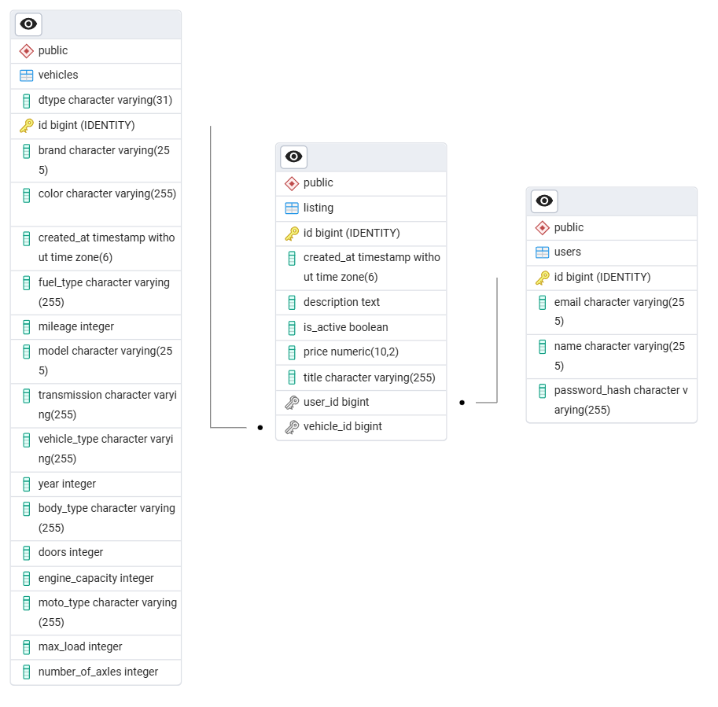

# Uruchomienie aplikacji:

1. Zbuduj i uruchom kontenery:
   ```bash
   docker-compose up --build

2. Otwórz w przeglądarce:
    http://localhost:8080/swagger-ui/index.html#/

---

# Diagram ERD bazy danych:



---

# 📦 Wzorce projektowe zastosowane w projekcie *Vehicle Market*

Projekt wykorzystuje szereg klasycznych wzorców projektowych i architektonicznych, które wspierają dobre praktyki w programowaniu obiektowym oraz z użyciem Spring Boot. Poniżej opis zastosowanych wzorców:

---

## 1. Model-View-Controller (MVC)

**Lokalizacja:**
- `controller/` – warstwa kontrolerów REST (interfejs API)
- `service/` – logika aplikacyjna
- `entity/`, `repository/` – warstwa modelu danych i persystencji

**Opis:**  
Projekt został oparty o architekturę MVC, w której każda warstwa ma jasno zdefiniowaną odpowiedzialność. Umożliwia to łatwe utrzymanie i rozbudowę systemu.

---

## 2. Repository Pattern

**Lokalizacja:**  
- `repository/VehicleRepository.java`  
- `repository/UserRepository.java`  
- itd.

**Opis:**  
Repozytoria rozszerzają `JpaRepository`, co pozwala na abstrakcję nad warstwą dostępu do danych. Ułatwia to testowanie i pozwala na oddzielenie logiki aplikacyjnej od logiki dostępu do danych.

---

## 3. Service Layer Pattern

**Lokalizacja:**  
- `service/VehicleService.java`  
- `service/ListingService.java`

**Opis:**  
Warstwa serwisowa pośredniczy między kontrolerami a repozytoriami. Przechowuje logikę biznesową i zapewnia modularność kodu.

---

## 4. Dependency Injection (DI)

**Lokalizacja:**  
- Konstruktorowe wstrzykiwanie zależności w kontrolerach i serwisach (`@Service`, `@RestController`)

**Opis:**  
Wzorzec wstrzykiwania zależności został zaimplementowany przy pomocy Spring Framework, co pozwala na luźne powiązania między komponentami oraz ułatwia testowanie jednostkowe.

---

## 5. Dziedziczenie i polimorfizm (OO)

**Lokalizacja:**  
- `Vehicle.java` (klasa bazowa)
- `Car`, `Truck`, `Motorcycle` (klasy pochodne)

**Opis:**  
Dziedziczenie umożliwia współdzielenie cech wspólnych między pojazdami oraz implementację specyficznych właściwości w podklasach. To przykład stosowania zasad programowania obiektowego oraz podstaw wzorca Template Method.

---

## 6. Open/Closed Principle (SOLID)

**Lokalizacja:**  
- `VehicleService.java` – metody operujące na `Vehicle` i jego podtypach

**Opis:**  
Kod jest otwarty na rozszerzenia (nowe typy pojazdów) i zamknięty na modyfikacje istniejących klas. Nowe typy mogą zostać dodane jako kolejne klasy dziedziczące bez konieczności modyfikowania logiki głównej.

---

## 7. RESTful Design

**Lokalizacja:**  
- `ListingController`, `VehicleController`, `UserController`

**Opis:**  
Kontrolery zostały zaprojektowane zgodnie z REST API best practices – użycie `@GetMapping`, `@PostMapping` itd., zasoby adresowane przez URI, stosowanie `ResponseEntity`.

---

## 8. Enum Pattern

**Lokalizacja:**  
- `Model/FuelType`, `TransmissionType`, `VehicleType` itd.

**Opis:**  
Enumy są używane do reprezentowania ograniczonych zbiorów wartości, co poprawia czytelność i bezpieczeństwo typów w kodzie.

---

## Podsumowanie

Projekt jest dobrze ustrukturyzowany, oparty na solidnych fundamentach wzorców projektowych i architektonicznych. Przygotowany jest na dalszy rozwój i łatwe utrzymanie.

